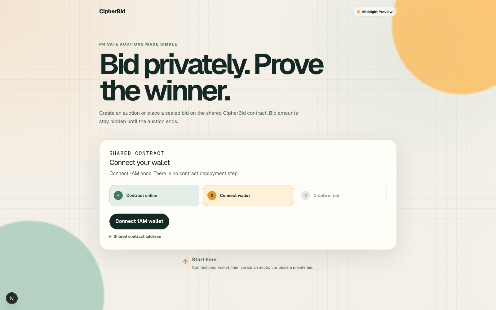
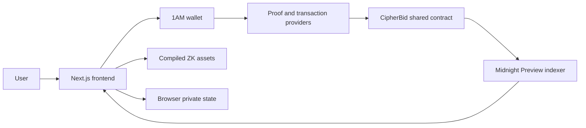

# CipherBid

[](https://github.com/xy-69-yx/CipherBid/actions/workflows/ci.yml)

CipherBid is a privacy-preserving sealed-bid auction application built on
Midnight. Auction creators publish an auction, bidders submit commitments
without exposing their bid amounts, and the contract verifies the reveal before
selecting the winner.

The application uses one shared contract on Midnight Preview. Visitors do not
deploy their own contract; they connect a 1AM wallet and either create an
auction or place a private bid.

## Links

| Resource | Link |
| --- | --- |
| Live application | [cipher-bid-nine.vercel.app](https://cipher-bid-nine.vercel.app) |
| Demo video | [Watch the CipherBid walkthrough](docs/demo/cipherbid-demo.mp4) |
| Deployed contract | [View on 1AM Explorer](https://explorer.1am.xyz/contract/92ba0c6e876224955ab29bd3cb527bb4b4c99a6e03df189236118c2e79367b48?network=preview) |
| Source repository | [github.com/xy-69-yx/CipherBid](https://github.com/xy-69-yx/CipherBid) |
| Compact contract | [`contracts/cipherbid.compact`](contracts/cipherbid.compact) |
| 1AM wallet | [1am.xyz](https://1am.xyz) |

## Demo Video

<table>
  <tr>
    <td align="center" width="900">
      <strong>CipherBid walkthrough</strong>
      <br />
      <br />
      <a href="docs/demo/cipherbid-demo.mp4"><strong>Watch the demo video</strong></a>
      <br />
      <sub>Contract connection, auction creation, and private bidding walkthrough</sub>
    </td>
  </tr>
</table>

The recommended demo flow is:

1. Open the live application with the 1AM wallet installed.
2. Connect 1AM on Midnight Preview.
3. Create an auction and save its auction number.
4. Switch to **Place a bid**.
5. Submit a private bid using the auction number.
6. Save the returned bid number and private bid key.

## Screenshots

### Landing and wallet connection



| Create auction | Place a private bid |
| --- | --- |
| Connect 1AM and select **Create auction** to enter the reserve price and closing time. | Select **Place a bid**, enter the auction number and amount, then approve the private transaction. |
| Add the connected auction screenshot at `docs/screenshots/create-auction.png`. | Add the connected bidding screenshot at `docs/screenshots/place-bid.png`. |

## Contract Details

| Field | Value |
| --- | --- |
| Contract | `CipherBid` |
| Network | Midnight Preview |
| Contract address | `92ba0c6e876224955ab29bd3cb527bb4b4c99a6e03df189236118c2e79367b48` |
| Compact language version | `0.23` |
| Maximum bids per auction | `8` |
| Frontend actions | Create auction, place bid |
| Contract source | [`contracts/cipherbid.compact`](contracts/cipherbid.compact) |
| Generated client | [`contract/src/managed/cipherbid`](contract/src/managed/cipherbid) |

The contract maintains global auction and bid counters plus maps containing
auction and bid records. Each browser also has a private `localSk` value used to
derive a pseudonymous application identity. The frontend stores this value in
browser storage under a key scoped to the deployed contract.

### Contract circuits

| Circuit | Purpose | Authorization |
| --- | --- | --- |
| `createAuction` | Creates an open auction with a reserve price and closing timestamp. | Any connected user |
| `getAuction` | Reads an auction record. | Public |
| `updateAuction` | Changes an open auction's reserve price or closing timestamp. | Auction organizer |
| `deleteAuction` | Removes an auction that has no bids. | Auction organizer |
| `bid` | Stores a commitment to a private bid amount and nonce. | Any connected user |
| `getBid` | Reads a bid record. | Public |
| `updateBid` | Replaces the commitment for an existing open-auction bid. | Original bidder |
| `deleteBid` | Removes an existing open-auction bid. | Original bidder |
| `seeAllBids` | Verifies and reveals the fixed batch of auction bids. | Auction organizer |
| `finalizeAuction` | Reveals all bids, checks the reserve, and records the winner. | Auction organizer |

`seeAllBids` and `finalizeAuction` accept a fixed vector of eight reveal entries.
Unused entries must use `bidId = 0`.

The current public frontend intentionally exposes only `createAuction` and
`bid`. Reveal, finalization, update, and delete remain contract capabilities but
are not currently part of the end-user interface.

## How to Use

### Prerequisites

- A modern Chromium-based browser
- The [1AM browser extension](https://1am.xyz)
- 1AM configured for the Midnight Preview network
- Enough Preview network resources to submit transactions

### Create an auction

1. Open the [live application](https://cipher-bid-nine.vercel.app).
2. Connect the 1AM wallet and approve the Preview connection.
3. Select **Create auction**.
4. Enter a whole-number minimum price.
5. Choose a bidding closing date and time.
6. Submit the transaction and approve it in 1AM.
7. Save and share the auction number returned by the contract.

### Place a private bid

1. Connect the 1AM wallet.
2. Select **Place a bid**.
3. Enter the auction number supplied by the organizer.
4. Enter a whole-number bid amount.
5. Keep the generated private bid key, or generate a new one.
6. Submit the bid and approve the transaction in 1AM.
7. Save the returned bid number and private bid key.

The bid number, original amount, and private bid key are required to construct
the reveal data later. Losing this information can make the bid impossible to
reveal.

## Architecture



### Frontend

The Next.js client provides the create-auction and place-bid forms. It uses the
single contract address exported by [`lib/cipherbid.ts`](lib/cipherbid.ts), so
users cannot accidentally target a different deployment.

### Wallet and providers

[`lib/midnight.ts`](lib/midnight.ts) connects to 1AM on `preview` and builds the
Midnight providers used for:

- loading proving artifacts;
- proving and balancing transactions;
- submitting wallet-approved transactions;
- watching the Preview indexer for finalization.

### Private state

The Compact witness uses a 32-byte `localSk`. CipherBid generates one value per
browser and contract, then persists it in local storage. The contract derives a
pseudonymous organizer or bidder identifier from this value instead of
publishing the raw secret.

### Shared contract

Every user interacts with the same deployed contract:

```text
92ba0c6e876224955ab29bd3cb527bb4b4c99a6e03df189236118c2e79367b48
```

The contract was deployed once by the project owner. There is no deployment
button or user-controlled contract-address input in the application.

## Why Privacy Matters

Traditional on-chain auctions expose bids as soon as they are submitted. That
visibility can change bidder behavior, encourage last-minute undercutting, and
give later bidders an informational advantage.

CipherBid uses a commit-and-reveal design:

1. The bidder chooses an amount and a random 32-byte nonce.
2. The contract computes a domain-separated commitment from the auction ID,
   amount, and nonce.
3. Only the commitment is stored during the bidding phase.
4. During reveal, the amount and nonce must reproduce the stored commitment.
5. The contract compares verified reveals and records the highest valid bid.

This lets the contract prove that a revealed amount matches the original bid
without publishing that amount when the bid is first submitted.

## Privacy Model

| Data | During bidding | After reveal/finalization |
| --- | --- | --- |
| Auction ID | Public | Public |
| Reserve price | Public | Public |
| Closing timestamp | Public | Public |
| Bid ID | Public | Public |
| Bid commitment | Public | Public |
| Bid amount | Hidden | Revealed |
| Bid nonce/private bid key | Private | Supplied for reveal |
| Raw browser `localSk` | Private | Private |
| Derived bidder identity | Public pseudonym | Public pseudonym |
| Winning bid and bidder | Not selected | Public |

### Trust and limitations

- Privacy depends on keeping the bid amount and nonce secret before reveal.
- The browser `localSk` is stored in local storage, not in hardware-backed
  secure storage. Clearing site data changes the user's CipherBid identity and
  can prevent organizer- or bidder-authorized follow-up actions.
- The current contract records `endAt`, but the circuits do not enforce it
  against block time. The timestamp is currently informational.
- Every bid must be revealed before `finalizeAuction` succeeds.
- An auction supports at most eight bids.
- The application is deployed on Preview and should be treated as testnet
  software, not as an audited production auction system.

## Local Development

Requirements:

- Node.js 22 or newer
- npm
- Compact compiler only when regenerating the contract bundle

Install dependencies without requiring or creating a package lock:

```bash
npm install --no-package-lock
```

Start the development server:

```bash
npm run dev
```

Open [http://localhost:3000](http://localhost:3000).

### Regenerate the contract bundle

```bash
npm run compile
npm run sync:assets
```

The generated browser proving assets are copied into `public/zk/cipherbid`.

### Validate a production build

```bash
npm run lint
npm run build
```

## CI

The GitHub Actions workflow contains two jobs:

1. **Compile contract** installs the pinned Compact CLI and compiler, installs
   dependencies without a package lock, compiles the contract, and uploads the
   generated bundle.
2. **Build frontend** downloads that bundle, synchronizes the proving assets,
   and creates the Next.js production build.

See [`.github/workflows/ci.yml`](.github/workflows/ci.yml).

## Project Structure

```text
.
├── app/                         # Next.js routes and CipherBid interface
├── contract/src/               # Generated contract client and witnesses
├── contracts/                  # Compact source contract
├── docs/screenshots/           # README screenshots
├── lib/cipherbid.ts             # Shared contract configuration and client
├── lib/midnight.ts              # 1AM and Midnight provider integration
├── public/zk/cipherbid/         # Browser proving and verifier assets
└── .github/workflows/ci.yml     # Contract and frontend CI jobs
```
